# DESARROLLO DE APLICACIÓN WEB

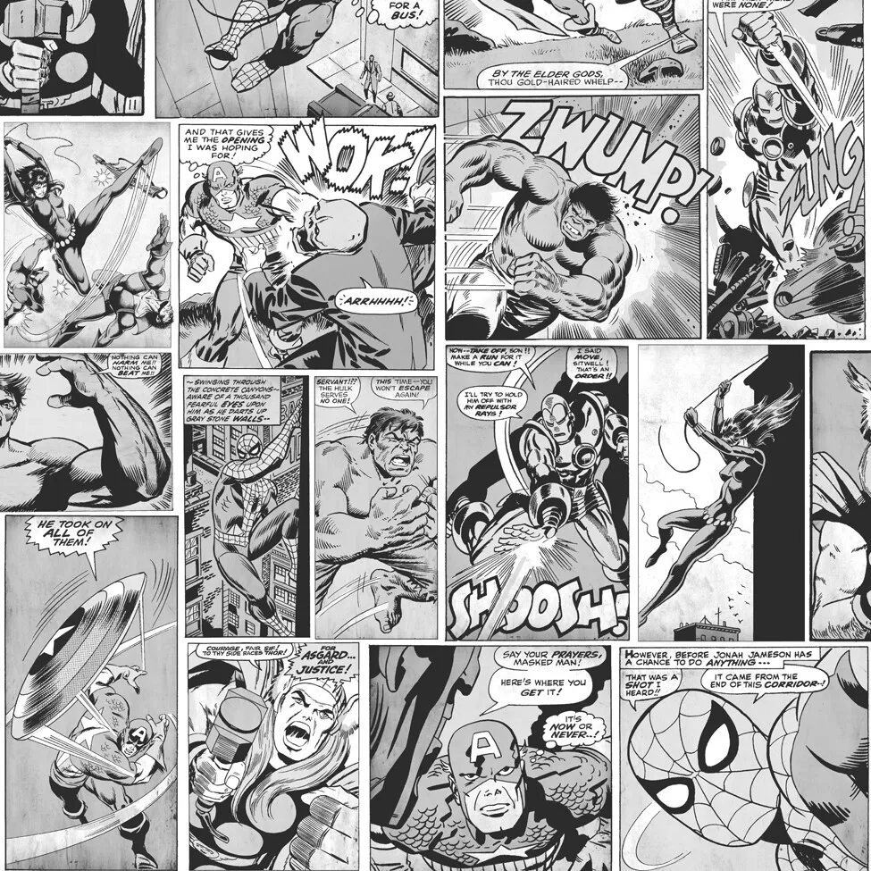

## Índice de contenido

- [1. Idea de la Aplicación](#3-idea-de-la-aplicación)
- [2. Tecnologías a Utilizar](#4-tecnologías-a-utilizar)
- [3. Guía de Estilos](#5-guía-de-estilos)
- [5. Instalación del Proyecto](#7-instalación-del-proyecto)
- [6. Desarrollo](#8-desarrollo)
- [7. Despliegue](#9-despliegue)
- [8. Manual](#10-manual)
- [9. Conclusiones](#11-conclusiones)

## 1. Idea de la Aplicación

Mi idea inicial era crear una tienda de comics de Marvel, un espacio donde los amantes de Marvel puedan mantenerse al día con las últimas noticias del universo Marvel y conseguir fácilmente sus cómics favoritos. Esta aplicación te ofrece acceso directo a una amplia colección de cómics, tanto clásicos como recientes, permitiéndote explorar, descubrir y comprar tus historias favoritas. Con una experiencia de compra simplificada y agradable.

## 2. Tecnologías a Utilizar

Para el desarrollo de la aplicación, se emplearon las tecnologías Laravel, Vue.js, npm y Docker.

## 3. Guía de Estilos

En cuanto a la guía de estilos de mi app, he optado por utilizar una paleta de colores en gris, blanco y negro, inspirada en los comics antiguos para darle ese toque distintivo.

## 5. Instalación del Proyecto

La instalación del proyecto es sencilla. Para el frontend, clonas el repositorio, abres un terminal en su directorio y ejecutas 'npm install', luego lo despliegas con 'npm run dev'. En cuanto al backend, clonas el repositorio y ejecutas 'docker-compose up'. En caso de problemas durante el despliegue del backend, puedes usar los siguientes comandos:

     chmod -R 775 storage
     chmod -R 775 bootstrap/cache

Eso es para los permisos de la API, en cuanto a la realizacion debes de migrar y ejecutar los seeders con los siguientes comandos:

     ./vendor/bin/sail artisan migrate
     ./vendor/bin/sail artisan db:seed --class=NewsSeeder
     ./vendor/bin/sail artisan db:seed --class=ComicsSeeder

## 6. Desarrollo

Durante el desarrollo del backend, me encontré con varios desafíos tras experimentar múltiples fallos inesperados.

Implementación de Compras de Última Hora en el Frontend 🛒
La integración de la sección de compras en el frontend fue una tarea de última hora que requirió un esfuerzo adicional, debido al tiempo limitado disponible.

Enrutado de la Aplicación con Pinia 🗺️
El enrutado de la aplicación con Pinia resultó más complejo que en el proyecto anterior en React. Al principio, la metodología utilizada no estaba completamente clara para mí, pero finalmente logré comprenderla después de la última sesión de explicaciones.

Herramientas para el Control de Versiones 🛠️
Para el control de versiones, utilicé Git y GitHub, lo que facilitó el seguimiento de los cambios y la colaboración efectiva con el equipo.

## 7. Resultado final

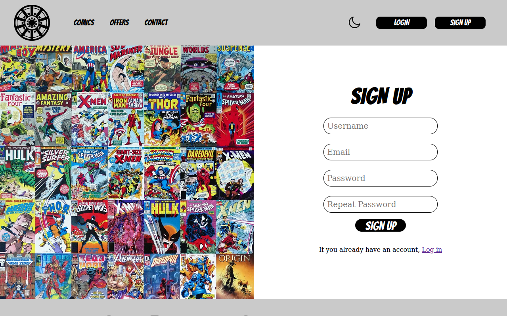
Imagen del registro : En esta pantalla, se realiza una solicitud POST a la API para crear un nuevo usuario. Si el correo electrónico ya está registrado en la base de datos, no se puede crear la cuenta y se muestra un mensaje adecuado al usuario.

Imagen del login: En esta pantalla se realiza una llamada a la API para iniciar sesión. Una vez autenticado correctamente, se recibe un token de usuario. Este token permite realizar llamadas más complejas y personalizadas para ofrecer una experiencia única al usuario.

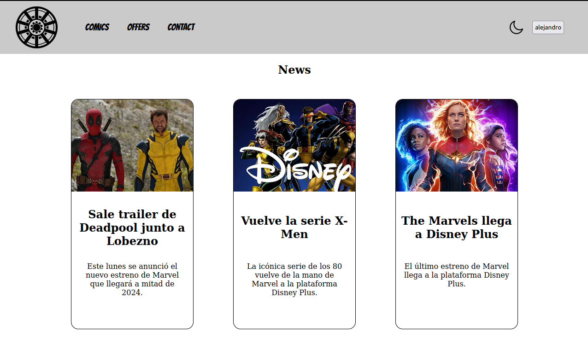
Imagen noticias: En esta pantalla principal de la aplicación, se muestran las tres noticias más recientes relacionadas con Marvel. Estas noticias se obtienen mediante una solicitud fetch a la API correspondiente.

Además, una vez que el usuario ha iniciado sesión, se muestra un botón con el nombre del usuario para acceder a su perfil personal.

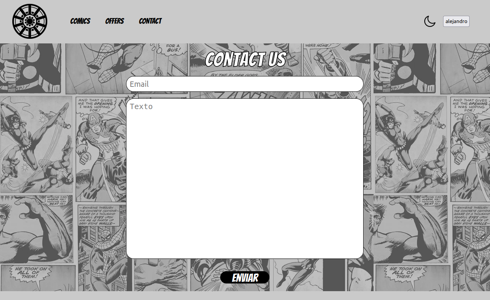
Imagen de contacto: Formulario simple para enviar una review de la apliación

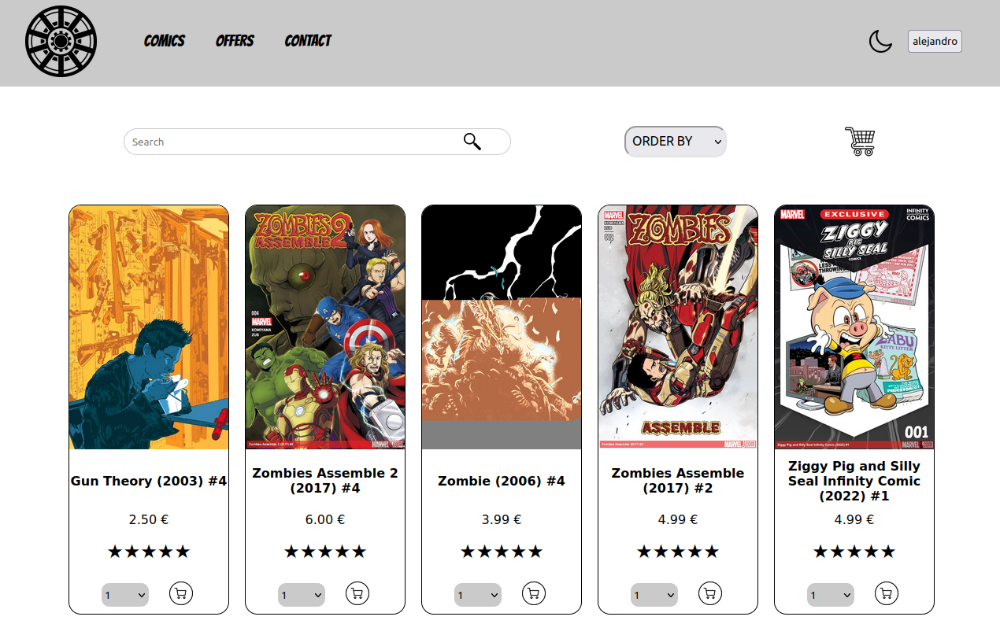
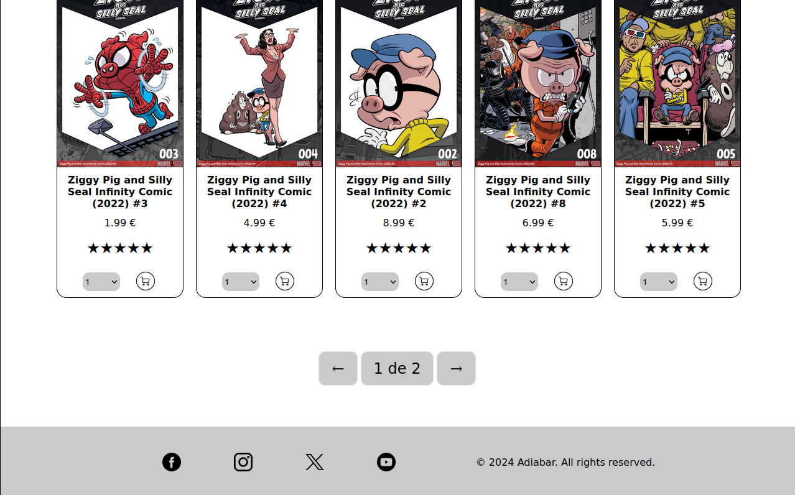
Imagenes comics: En esta pantalla, se realiza un paginado de los cómics disponibles, junto con un buscador y un filtro para facilitar la búsqueda. Cada cómic se muestra en una tarjeta con detalles relevantes.

Además, se incluye un botón para acceder al carrito de compras, permitiendo a los usuarios ver los cómics seleccionados para compra.

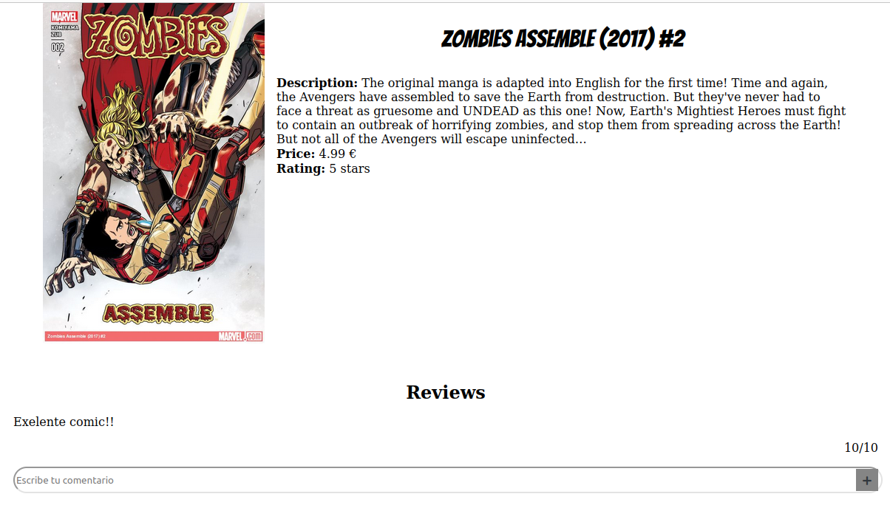
Imagen detalles del comic: En esta pantalla, los usuarios pueden ver los detalles del cómic seleccionado. Se muestra una descripción detallada del cómic, así como las valoraciones y reseñas en forma de comentarios. Si el comentario es propio, aparece a la derecha; de lo contrario, aparece a la izquierda.

Además, se incluye la valoración general del cómic para que los usuarios puedan tener una idea rápida de la opinión general de otros usuarios.

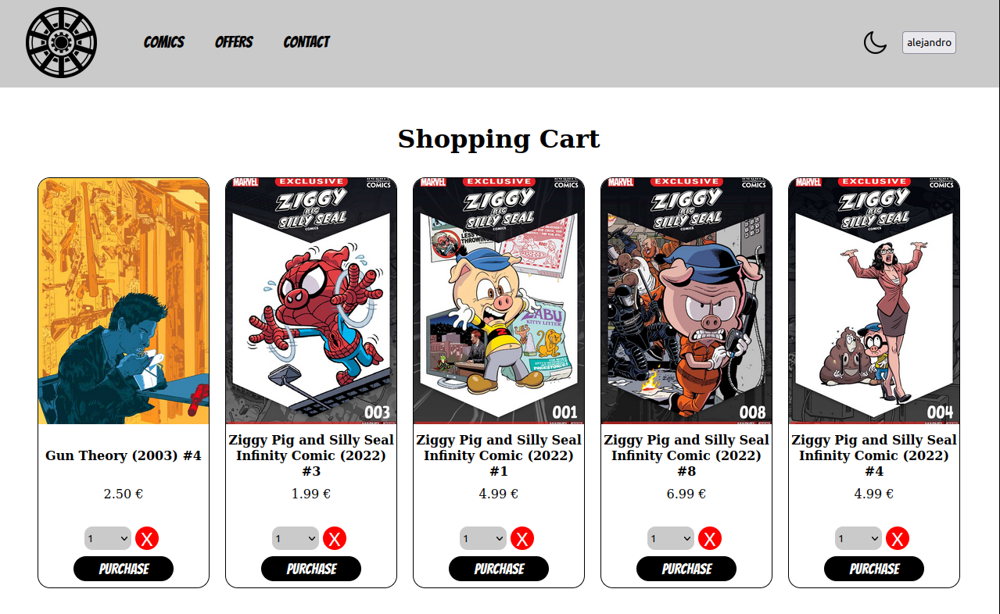
Imagen carrito: En esta pantalla, los usuarios tienen acceso a los cómics que han añadido al carrito. Desde aquí, tienen la opción de eliminar cómics seleccionados o proceder a la página de compra para finalizar la transacción.

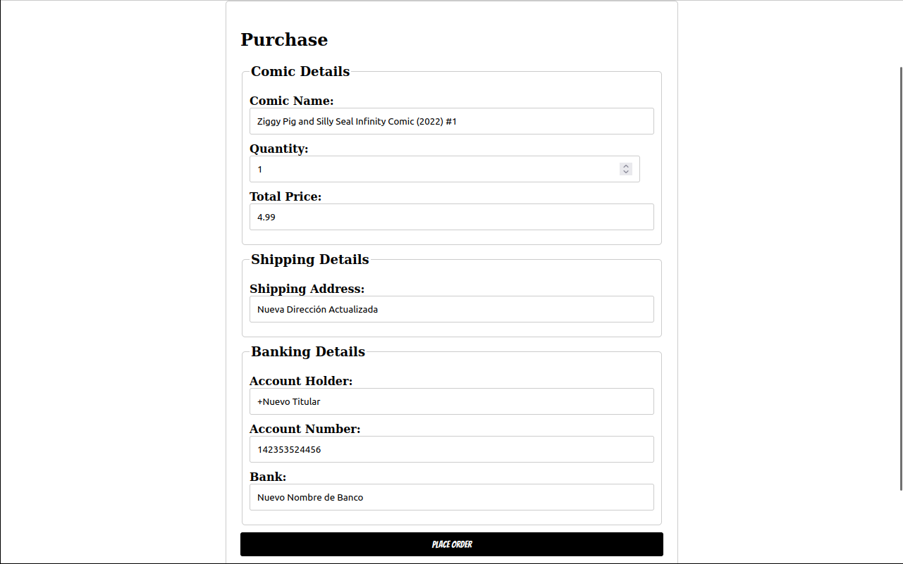
Imagen compra: En esta pantalla, los usuarios pueden ver los detalles simplificados del cómic seleccionado para comprar. Además, tienen la opción de añadir los detalles necesarios para la compra, como dirección de envío o método de pago. Si han realizado compras previas, estos detalles se completarán automáticamente para facilitar el proceso.

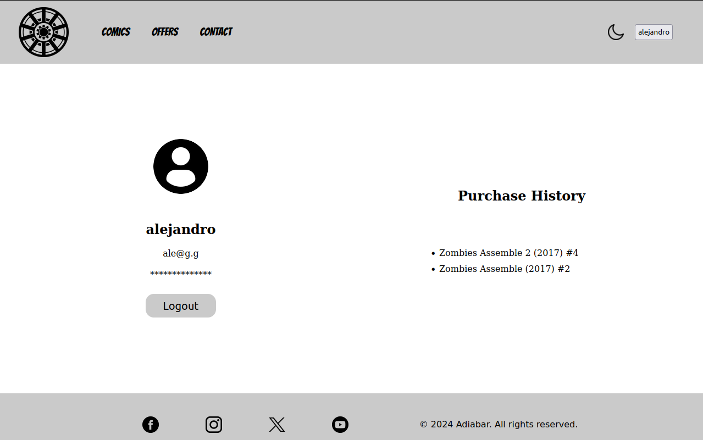
Imagen perfil: En esta pantalla, los usuarios pueden ver su correo electrónico, su nombre de usuario y tienen la opción de cerrar sesión. Además, pueden acceder a su historial de compras para revisar las compras realizadas anteriormente.

## 7. Despliegue

Para el despliegue he elegido netlify ya que es un lugar cómodo para subir tu web

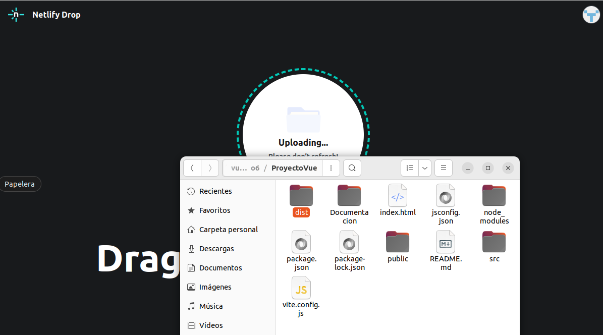
Imagen de despliegue : Podemos ver que es un simple drag and drop

Enlace del despliegue : https://65e220edffad9200a8180192--fascinating-madeleine-f5d7b4.netlify.app/#/

## 9. Tablas de la base de datos

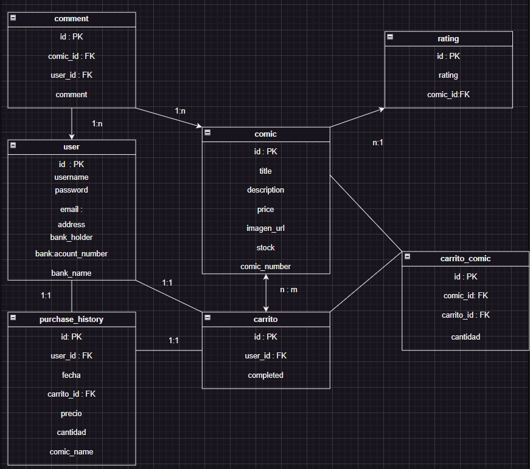

Imagen de base de datos diagrama

## 9. Conclusiones

Como conclusión, creo que este proyecto me ha ayudado a aprender a organizarme un poco mejor en cuanto a la realización de cada contenido. También creo que he aprendido mucho del backend, ya que es a lo que más he dedicado tiempo, debido a los multiples errores. Me ha servido mucho para aprender un nuevo framework como es Vue, y he aprendido a realizar un diseño más profesional en la web que he desarrollado.

